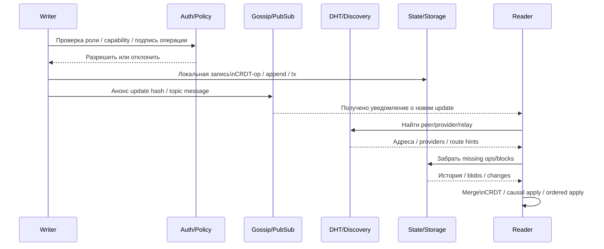

# Реализация децентрализованных P2P групп

## Executive summary

Для **децентрализованных P2P групп** нет одного «лучшего» подхода: решения расходятся по тому, *что именно считать группой* — membership, доставку сообщений, общее состояние, историю, права доступа или криптографическую защиту. На практике большие системы собираются из нескольких слоёв: discovery и membership через DHT или peer-sampling, dissemination через gossip/pub-sub, состояние через CRDT или append-only log, а политики и права — либо через отдельный авторизационный слой, либо через федеративные серверы, либо через ledger/consensus. citeturn14view4turn20view0turn15view1turn19view0turn30view0turn16view0

Если цель — **масштабирование до потенциально очень большого числа участников**, лучше всего работают архитектуры, где каждый узел видит только малую часть сети: DHT с логарифмической маршрутизацией, gossip с partial views, pub/sub с topic meshes и федерация, где клиент не обязан знать всю сеть. Напротив, глобальный total order и сильная согласованность на одном горячем общем объекте обычно не масштабируются без ограничения числа валидаторов/серверов либо без вынесения части нагрузки в rollups, sharding или document/topic partitioning. Это важная инженерная граница, а не недостаток конкретного протокола. citeturn21view5turn20view0turn15view3turn15view1turn17view4turn17view5turn17view3

Для **чата и событийных потоков** чаще всего побеждают pub/sub, gossip и messaging-протоколы с E2EE. Для **совместного редактирования** — CRDT и, реже, OT. Для **распределённого хранилища** — DHT, append-only logs и P2P databases. Если же ключевая задача — **жёсткое управление ролями, правами, аудитом и “кто имеет право писать раз в N секунд/минут”**, то в чистом P2P такие политики почти всегда приходится выносить либо в permissioned ledger, либо в federated servers, либо в hybrid P2P с центральной или квази-центральной policy-plane. citeturn15view1turn19view0turn19view2turn7search1turn14view4turn31view0turn16view1turn16view0turn28view0turn13view2

Самый практичный вывод: **для «неограниченной» по масштабу группы почти всегда нужна композиция**. Типичный современный стек выглядит так: `libp2p/WebRTC/Tor/Bluetooth → DHT или peer sampling → gossip/pubsub → CRDT или signed append-only log → E2EE/MLS → отдельный слой политик`. Исключение — федерация, где часть этой композиции скрыта внутри серверов. citeturn15view5turn14view4turn20view0turn15view1turn19view1turn14view0turn18view5turn30view0turn13view0

## Рамка анализа

Под «децентрализованной P2P группой» полезно понимать не один протокол, а набор функций: обнаружение и membership, рассылка обновлений, хранение и репликация состояния, согласование конфликтов, управление правами, а также приватность данных и метаданных. DHT и peer-sampling решают первую часть; gossip и pub/sub — вторую; CRDT, append-only logs и distributed DB — третью; consensus и ledgers — четвёртую; MLS, OMEMO, Olm/Megolm и прикладные ACL — пятую и шестую. Из-за этого один и тот же продукт может быть «P2P группой» сразу в нескольких архитектурных смыслах. citeturn14view4turn20view0turn15view1turn19view0turn30view0turn13view4turn13view3

В этом отчёте я оцениваю подходы по таким критериям: как они масштабируются по числу участников; каким способом синхронизируют данные и membership; есть ли нативная или прикладная поддержка ролей, read-only режимов, write ACL, rate limits и расписаний; как устраняют конфликтующие изменения; как выглядят угрозы и свойства приватности; какие требования они предъявляют к сети, discovery, NAT traversal, CPU, памяти и storage. Эта рамка особенно важна, потому что низкоуровневые overlays почти никогда не дают права доступа «из коробки», а высокоуровневые схемы прав почти всегда требуют либо доверенных серверов, либо криптографических capability-объектов, либо консенсуса. citeturn16view1turn16view0turn31view0turn31view1turn18view5turn18view4

Большинство первоисточников в этой области доступны только на английском; из заметных официальных исключений есть, например, README проекта cjdns с русской версией. Поэтому ниже я приоритизирую официальные спецификации, RFC, whitepapers и оригинальные статьи, а русскоязычность отмечаю только там, где она действительно существует в первоисточнике. citeturn24view0

## Архитектурные паттерны и потоки данных

Ниже — обобщённая схема трёх семейств, которые на практике чаще всего конкурируют за роль «архитектуры группы»: overlay-first P2P, федерация и ledger-based координация. Она агрегирует идеи из Kademlia/libp2p/IPFS, gossip/pubsub overlays, Matrix/XMPP/ActivityPub и blockchain/consensus-систем. citeturn15view0turn14view4turn15view1turn13view0turn13view2turn16view3turn17view0turn16view2

```mermaid
graph TD
  subgraph Overlay-first P2P
    A[Peer] --> B[Transport<br/>libp2p / WebRTC / Tor / Bluetooth]
    B --> C[Discovery / Membership<br/>DHT / Peer Sampling]
    C --> D[Dissemination<br/>Gossip / PubSub]
    D --> E[State Layer<br/>CRDT / Append-only log / KV]
    E --> F[Policy & Crypto<br/>ACL / Capabilities / MLS / Signatures]
  end

  subgraph Federated Servers
    U1[Client] --> HS1[Homeserver A]
    U2[Client] --> HS2[Homeserver B]
    HS1 <--> HS2
    HS1 --> RS[Room/Event State<br/>Roles / Power levels / Moderation]
    HS2 --> RS
  end

  subgraph Ledger-based Coordination
    P1[Client/Peer] --> MP[Mempool / Gossip]
    P2[Client/Peer] --> MP
    MP --> V[Validator or Orderer Set]
    V --> L[Shared Ledger / Ordered Log]
    L --> APP[Application State / ACL / Audit]
  end
```

Следующая схема показывает типичный поток обновления в **hybrid P2P группе**: операция сначала авторизуется и подписывается, затем распространяется как событие, а missing data подтягиваются из DHT или content-routing слоя; локальное состояние сливается CRDT-алгоритмом или применяет уже упорядоченный consensus-order. Именно так сегодня строятся наиболее практичные «большие» группы: без требования, чтобы каждый узел одновременно был и directory, и broadcaster, и database, и policy-engine. citeturn15view5turn14view4turn20view2turn19view3turn19view0turn17view4turn17view5

## Подходы и реализации

**DHT-оверлеи.** DHT хорошо подходят для групп, если проблема формулируется как *key-based discovery, routing и шардированное хранение*, а не как богатая семантика комнаты. Chord прямо формулирует целевую модель как scalable lookup service; стоимость lookup растёт логарифмически с числом узлов, а система полностью распределена и автоматически подстраивает таблицы при churn. Современные Kademlia-варианты в libp2p/IPFS наследуют ту же идею: peer/content routing через XOR-метрику, `k`-репликацию и поиск ближайших узлов; IPFS использует DHT для provider records, peer records и IPNS-записей. Для репликации mutable state DHT почти всегда комбинируют с версиями, vector clocks и приложенческим merge, как в Dynamo. Нативной поддержки политик вида «только чтение», «пишет только роль X» или «раз в N секунд» у DHT обычно нет: максимум — проверка подписи записи и прикладные правила принятия обновлений. С точки зрения приватности DHT обычно плохо скрывают метаданные маршрутизации; для NAT traversal и практической reachability нужны bootstrap peers, relays или hole punching. Примеры: Kademlia/libp2p Kad-DHT, IPFS DHT, Chord, Dynamo. citeturn21view5turn15view0turn14view4turn18view2turn33view0turn33view4

**Gossip и epidemic membership.** Gossip-семейство решает другую задачу: не адресный lookup, а *дешёвое поддержание membership и широковещательное распространение обновлений*. SWIM разделяет failure detection и dissemination membership changes, добиваясь постоянной ожидаемой стоимости на узел вместо heartbeat-подходов с квадратичной нагрузкой; HyParView делает partial views явным примитивом, а Plumtree объединяет дерево и gossip, чтобы держать низкий steady-state overhead и при этом быстро восстанавливаться после сбоев. В topic-oriented группах ту же роль играет Gossipsub: topic meshes, gossip о недавно виденных сообщениях, explicit peering и меры для attack resistance. Масштабирование получается за счёт того, что ни один участник не обязан знать весь состав группы. Однако это почти всегда **eventual dissemination**, а не глобальный total order: политики прав, кворумы, causal stability и противодействие spam/helpful-byzantine peers нужно добавлять выше, через peer scoring, подписи, validators или внешнюю policy-plane. Gossip очень хорош там, где важны fanout и fault masking, но сам по себе не является системой authoritatively ordered state. citeturn20view0turn15view3turn15view4turn15view1turn15view2

**CRDT и local-first репликация.** CRDT-подходы важны, когда группа должна редактировать общее состояние *без центрального координатора и без остановки на конфликте*. Классическое исследование Shapiro и соавторов формализует CRDT как семейство типов, для которых eventual convergence обеспечивается математическими свойствами merge/operations, без консенсуса на критическом пути; это даёт отличную tolerance к offline и partition, но не решает всех задач — в частности, garbage collection и отдельные редкие операции могут требовать слабой синхронизации. Современные библиотеки вроде Automerge и Yjs делают это практичным: Automerge передаёт только missing changes и автоматически сливает конкурентные изменения; Yjs network-agnostic, порядок применения update-ов не важен, а shared types синхронизируются с автоматическим merge. Для collaborative editing CRDT — главный конкурирующий подход к OT; OT остаётся исторически важным и использовался, например, в Google Wave, но экосистема local-first в последние годы заметно сместилась в сторону CRDT. Ограничение здесь в другом: *политики и права не встроены в CRDT-модель*. Read-only, roles, periodic write, revocation и quota обычно лежат вне CRDT и требуют отдельных подписей, capability-документов, серверной authorisation или group-key management. По этой причине CRDT идеальны для совместного редактирования и offline-first, но редко бывают единственным слоем в production-группе. citeturn19view0turn19view1turn19view2turn19view3turn18view4turn7search1turn7search0

**Blockchain и ledger-based архитектуры.** Ledger-подходы решают проблему наоборот: не «пусть все редактируют и потом сольём», а «пусть все согласятся на один упорядоченный журнал». Bitcoin достигает этого через P2P timestamp server и chain of proof-of-work; permissioned и more practical варианты используют Raft, PBFT или BFT-производные вроде Tendermint. Это даёт сильную аудитируемость, недвусмысленные права, историю и детерминированный порядок операций — именно поэтому ledger особенно хорош для governance, quotas, escrow, rate limits и других policy-heavy сценариев. На permissioned стороне Hyperledger Fabric прямо строится вокруг identities, MSP, policies и ACL; Cosmos SDK `x/authz` даёт делегирование конкретных привилегий. Цена — ограниченный throughput и рост coordination-cost при увеличении validator set; поэтому масштабирование почти всегда делается через *меньший консенсусный core и внешние слои*, включая rollups, где вычисление и state storage выносятся off-chain, а на L1 кладутся доказательства или summaries. Для приватности публичные ledger'ы слабы по умолчанию; permissioned chains и ZK/L2 делают картину лучше, но всё равно это другая экономическая и операционная модель, чем pure P2P collaboration. citeturn17view0turn17view2turn17view4turn17view5turn16view0turn16view1turn16view2turn16view5turn17view3

**Федеративные серверы.** Федерация — это компромисс между pure P2P и централизованным SaaS: децентрализация переносится с устройств на серверы/домены. ActivityPub задаёт client-to-server и server-to-server API для доставки контента и уведомлений; XMPP Core и MUC дают зрелую модель межсерверного обмена плюс богатое room control; Matrix строит комнаты как подписанный event graph, реплицируемый между participating servers, с state resolution и power levels. С инженерной точки зрения это часто самый зрелый способ строить «группы», потому что роли и moderation здесь уже first-class: Matrix имеет power levels и room state rules, XMPP MUC поддерживает moderators/admins, kick/ban, membership и passwords, а E2EE можно добавить через Olm/Megolm или OMEMO. Масштабирование достигается тем, что клиенты не держат overlay глобально, а servers обмениваются событиями. Минус — это уже не pure end-user P2P: нужен homeserver, его администрирование, доверие к availability этого уровня и отдельная работа по антиспаму. В ActivityPub спецификация прямо признаёт, что механизмы authentication/authorization не были жёстко стандартизованы и оставлены экосистеме. citeturn16view3turn16view4turn13view2turn13view3turn13view0turn28view0turn13view4

**Hybrid P2P.** На практике именно hybrid P2P чаще всего выигрывает у «чистых» вариантов. libp2p даёт общий транспортный каркас; его Kad-DHT решает routing/discovery, а hole punching уменьшает зависимость от централизованных STUN/TURN. IPFS показывает характерный стек: DHT как content routing, Bitswap как block exchange, delegated routing — как способ разгрузить слабые узлы. Hypercore/Hyperswarm идёт по линии signed append-only logs, peer-to-peer replication и DHT-адресуемого соединения, включая hole punching. Automerge repo показывает ещё более прикладной вариант: состояние остаётся CRDT-локальным, а transport может быть WebSocket, WebRTC или другой канал. Такой подход особенно полезен для больших групп с мобильными и браузерными клиентами: discovery, relay, storage и sync можно разнести по плоскостям и не требовать от каждого участника одинаковых обязанностей. Но гибридность означает, что политики и права не «следуют автоматически» из transport: их всё равно нужно делать отдельно, часто через sync server, auth webhook, capabilities или зашифрованные envelopes. citeturn15view5turn15view0turn14view4turn20view2turn20view5turn14view2turn19view1turn6search4

**Pub/sub overlays.** Topic-based pub/sub — очень сильный примитив для группового fanout, но его не стоит путать с полным решением общего состояния. Gossipsub описывает себя как general-purpose baseline pubsub protocol с randomized topic meshes и хорошими scaling properties; Scribe строил децентрализованный application-level multicast поверх Pastry и поддерживал большое число групп и участников на группу. Суть масштабирования здесь в topic partitioning и в том, что сообщения текут по overlay-мешу или multicast tree, а не broadcast’ятся всем. Но pub/sub не решает историю и конфликтующее mutable state: если нужно воспроизводить прошлое состояние, необходимы append-only logs, CRDT-документы или БД поверх topic layer. Аналогично, нативная политика ограничивается admission/peering/validators; подробные ACL, read-only и quota делают на application layer. Поэтому pub/sub — отличный dissemination layer для чатов, live-updates и event buses, но плохой единственный фундамент для коллаборативной БД. citeturn15view1turn15view2turn20view1

**Mesh и delay-tolerant сети.** Когда приоритетом становится не throughput, а survivability при плохой сети, появляются mesh- и DTN-архитектуры. Briar синхронизирует сообщения напрямую между устройствами, умеет Bluetooth, Wi‑Fi, memory cards и Tor, хранит content у подписчиков и избегает центральных серверов; в текущей реализации проект долго опирался на «one-hop social mesh» и дополнился Mailbox для доставки сообщений, когда собеседники онлайн в разное время. cjdns строит зашифрованную IPv6-сеть с адресацией на основе public keys и DHT routing. Ditto в прикладном смысле использует сразу несколько transport’ов — Bluetooth, P2P Wi‑Fi и LAN — и автоматически синхронизирует изменения между edge-устройствами, даже без интернета. Эти системы хороши для кризисной связи, полевых групп и edge-сценариев, но хуже подходят для truly global highly-interactive общего mutable state: пропускная способность, топология и latency слишком зависят от локальности и наличия связности. Политики здесь чаще invitation-based и доверительно-социальные, а не глобально enforceable. citeturn32view0turn9search8turn9search2turn24view0turn24view1turn24view2

**P2P databases.** P2P database-слой пытается упаковать discovery, репликацию и data model в один продукт. OrbitDB — serverless P2P database поверх IPFS и pubsub, с eventual consistency и CRDT merges; у него есть access controllers и write ACL по identity IDs. AntidoteDB уходит в сторону geo-replicated masterless DB: consistent hashing, master-less sharding, async replication через Cure, causal consistency и highly available transactions. Ditto позиционирует себя как cross-platform peer-to-peer database и делает ставку на practical auth, permissions и collection-level sync scopes (`AllPeers`, `BigPeerOnly`, `SmallPeersOnly`, `LocalPeerOnly`). В этом семействе особенно хорошо видно главное для групп: если вам нужно не просто «передавать сообщения», а хранить коллекции документов с разными режимами синхронизации и прав, то P2P DB может резко снизить сложность реализации. Но цена — зависимость от конкретного движка и его модели конфликтов. Для truly adversarial governance всё равно часто приходится добавлять отдельную identity/policy-plane или ledger. citeturn14view3turn31view0turn25view3turn31view3turn24view1turn31view2turn24view2turn31view1

**P2P messaging и group messaging protocols.** Здесь цель уже не общий mutable object, а защищённая групповая коммуникация. Secure Scuttlebutt строит идентичности на Ed25519, реплицирует append-only feeds и поддерживает private messages в feed-и с сокрытием содержимого и части recipient metadata; для более эффективной синхронизации используется EBT, loosely inspired by Plumtree. Briar ориентирован именно на private messaging, форумы и блоги при сильной модели угроз. MLS — это уже стандартный криптографический слой: RFC 9420 даёт asynchronous group keying с forward secrecy и post-compromise security, причём стоимость rekeying масштабируется логарифмически от размера группы; архитектурный RFC 9750 прямо пишет, что MLS не является полной IM-системой и должен встраиваться в single-provider, federated или peer-to-peer service, а transport-layer metadata privacy остаётся внешней задачей. Для групповых чатов это один из самых сильных современных кирпичей, но для rich shared state поверх него обычно всё равно добавляют CRDT, logs или БД. citeturn14view0turn29view0turn29view1turn29view2turn29view3turn32view0turn18view5turn30view0

## Сводная таблица сравнения

| Подход | Масштабируемость | Поддержка политик и ролей | Согласование конфликтов | Устойчивость к отказам | Приватность и шифрование | Сложность реализации | Примеры и первоисточники |
|---|---|---|---|---|---|---|---|
| DHT | Высокая для discovery/lookup; логарифмическая маршрутизация, естественное шардирование | Низкая нативно; обычно подписи, leases, capabilities поверх DHT | Обычно версии, vector clocks, app-level merge; иногда immutable values | Высокая при churn, если есть репликация и bootstrap | Интегритет — да; metadata privacy — слабая без доп. слоя | Средняя | Chord, Kademlia/libp2p, IPFS DHT, Dynamo citeturn21view5turn15view0turn14view4turn18view2turn33view0 |
| Gossip / epidemic | Очень высокая для membership и dissemination через partial views | Низкая нативно; admission, signatures, peer scoring добавляются сверху | Eventual dissemination; order/causality надо надстраивать | Очень высокая; избыточность хорошо маскирует сбои | Шифрование payload возможно, но transport metadata обычно видна | Средняя | SWIM, HyParView, Plumtree, Gossipsub citeturn20view0turn15view3turn15view4turn15view1turn15view2 |
| CRDT / local-first | Высокая для offline-first и multi-master; на «горячем» документе нужна сегментация | Низкая–средняя; права обычно внешние | Automatic merge, causal context; без consensus на критическом пути | Очень высокая при partition/offline | Хорошо сочетается с E2EE, но revocation/ACL не встроены | Средняя–высокая | Shapiro CRDTs, Automerge, Yjs, local-first; OT как альтернатива в Wave citeturn19view0turn19view1turn19view2turn18view4turn7search1turn7search0 |
| Blockchain / ledger | Средняя–высокая на уровне сети, но не на уровне одного consensus set; масштабируют через committees/rollups | Очень высокая; ACL, roles, authz, smart contracts, audit | Consensus-total-order | Очень высокая на integrity; availability зависит от модели сети и кворума | Публичные chain — слабая приватность; permissioned/ZK лучше | Высокая | Bitcoin, Tendermint, Hyperledger Fabric, Cosmos authz, Ethereum ZK-rollups citeturn17view0turn17view2turn16view0turn16view1turn16view2turn16view5turn17view3 |
| Федеративные серверы | Высокая практически; масштабирование переносится на servers/domains | Высокая; roles, bans, membership, moderation, power levels | Обычно server-mediated eventual consistency; в Matrix — state resolution на event DAG | Высокая, если серверов много; клиентам проще жить за NAT | Хорошо поддерживается transport и E2EE, но servers видят часть metadata | Средняя | Matrix, XMPP MUC + OMEMO, ActivityPub citeturn13view0turn28view0turn13view2turn13view3turn16view3turn16view4 |
| Hybrid P2P | Очень высокая в реальном мире: DHT + relays + hole punching + optional servers | Средняя; policy-plane обычно внешняя, но интегрируется хорошо | Зависит от payload: CRDT, logs, app rules или external consensus | Высокая, особенно при fallback на relays/sync servers | Хорошая для content; metadata зависит от relays/bootstrap | Высокая | libp2p, IPFS, Bitswap, Hypercore/Hyperswarm, Automerge Repo citeturn15view5turn14view4turn20view2turn14view2turn19view1turn6search4 |
| Pub/sub overlays | Очень высокая для fanout по темам; естественно шардируется topic’ами | Низкая нативно; validators/admission lists поверх topics | Конфликты не решает; нужна БД/лог/CRDT сверху | Высокая при хорошем overlay | E2EE payload возможен; topic metadata часто видна | Средняя | Gossipsub, Scribe citeturn15view1turn15view2turn20view1 |
| Mesh / delay-tolerant | Низкая–средняя глобально, но высокая по survivability в плохой сети | Средняя для invitation/contact-based моделей; слабая для глобальных ACL | Eventual sync, identity/log-centric ordering | Очень высокая при blackouts и цензуре, если есть физическая/локальная связность | Очень сильна против surveillance при правильном transport | Высокая | Briar, cjdns, Ditto edge mesh citeturn32view0turn9search8turn24view0turn24view1 |
| P2P databases | Средняя–высокая; зависит от shard model и объёма «живого» набора данных | Средняя–высокая в лучших реализациях | Обычно CRDT, causal consistency, HA transactions | Высокая при eventual/causal replication | Зависит от движка; write ACL есть чаще, чем read confidentiality | Средняя–высокая | OrbitDB, AntidoteDB, Ditto, Hyperbee/Hypercore citeturn14view3turn31view0turn25view3turn31view3turn24view1turn24view2turn14view2 |
| P2P messaging protocols | Высокая для группового обмена сообщениями и history replication | Средняя; membership native, rich ACL — чаще application-layer | Append-only feeds, causal/epoch ordering, group-key updates; не general mutable state | Высокая, особенно в async/offline messaging | Очень высокая: E2EE, FS, PCS, signed identities | Средняя–высокая | SSB, Briar, MLS citeturn14view0turn29view0turn29view2turn32view0turn18view5turn30view0 |

## Рекомендации по выбору

Ключевой практический выбор звучит так: **что именно должно быть бесконечно масштабируемым** — число участников сети, число одновременно активных подписчиков одной темы, число писателей одного документа или число узлов, которые обязаны согласовать каждый write? Эти четыре цели редко достигаются одним механизмом сразу. Отсюда и главный architectural heuristic: **не смешивать discovery, dissemination, mutable shared state и policy enforcement в один слой**, если только вы сознательно не строите ledger. Это уже не просто «предпочтение», а инженерный вывод из того, как устроены DHT, gossip, CRDT и consensus systems. citeturn14view4turn20view0turn19view0turn17view4turn17view5

| Сценарий | Рекомендуемый подход | Почему |
|---|---|---|
| Чат большой группы | `Pub/sub + messaging crypto + optional federation` | Для очень больших комнат dissemination почти всегда важнее общего mutable state. Gossipsub/overlay хорошо фэн-аутит сообщения, а MLS/OMEMO/Briar/Matrix решают E2EE и membership. Если нужна простота moderation и multi-device UX, федерация обычно практичнее pure P2P. citeturn15view1turn18view5turn13view3turn32view0turn13view0turn28view0 |
| Совместное редактирование | `CRDT + hybrid transport`, иногда `OT + server coordination` | Для офлайна и multi-master редактирования CRDT — лучший базовый кандидат. Разумный production-стек: Yjs/Automerge + WebRTC/libp2p/WebSocket sync + отдельный auth слой. OT имеет смысл, если вы уже опираетесь на центральный ordering/transform service и нужна совместимость с существующей экосистемой. citeturn19view1turn19view2turn19view3turn7search1turn15view5 |
| Распределённое хранилище и контент-адресация | `DHT + append-only logs / P2P DB` | Для lookup и репликации immutable/near-immutable данных DHT и content routing естественны; для mutable metadata добавляйте versioning и merge. Если нужны коллекции документов, causal consistency или готовая репликация — смотрите OrbitDB, AntidoteDB, Ditto. citeturn14view4turn18view2turn33view0turn14view3turn31view3turn24view1 |
| Управление политиками, ролями и аудитом | `Permissioned ledger` или `federated servers`, реже `hybrid P2P + central policy plane` | Чистый overlay сам по себе почти никогда не обеспечивает enforceable ACL. Если права должны быть строгими, проверяемыми и аудитируемыми, практичнее выбирать Fabric/Cosmos-like policy model или Matrix/XMPP room governance. Hybrid P2P остаётся полезным для data plane, но policy plane лучше держать отдельно. citeturn16view0turn16view1turn16view5turn28view0turn13view2 |

Если ваш приоритет — **“писать можно только роли X, не чаще чем раз в N, а остальные читают”**, то я бы не рекомендовал чистый DHT, чистый gossip или чистый CRDT как единственный фундамент. Эти подходы прекрасно доставляют и реплицируют данные, но policy enforcement у них прикладной и, в adversarial setting, легко превращается в distributed authorization problem. Для такой задачи лучше работает либо permissioned ledger с identities/ACL/smart contracts, либо federated room/server model, либо hybrid P2P, где authoritative policy decisions принимает отдельный, ограниченный по размеру consensus set. citeturn16view1turn16view0turn16view5turn28view0turn13view2turn17view4

Если же главный приоритет — **офлайн, low-latency local UX и устойчивость к разрывам связи**, то выбор смещается в сторону CRDT, append-only logs и mesh/hybrid P2P. Здесь разумный дизайн обычно выглядит так: локальная запись без ожидания сети, позже — sync missing changes, а на уровне прав — capability tokens, encrypted substreams или per-document share graph. Это особенно хорошо для small-to-medium groups, document collaboration и edge/mobile scenarios, но хуже для формализованного governance и «неоспоримого» порядка операций. citeturn19view0turn19view1turn19view2turn32view0turn24view1

Итоговая рекомендация в одном предложении: **для чатов — pub/sub + messaging crypto, для редактирования — CRDT + hybrid transport, для хранилища — DHT/logs/P2P DB, для политик — federation или permissioned ledger; для очень больших систем объединяйте эти слои, а не пытайтесь заставить один протокол быть всем сразу.** citeturn15view1turn18view5turn19view2turn14view4turn14view3turn16view1turn13view0